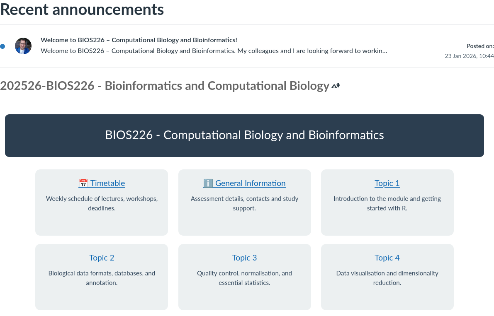
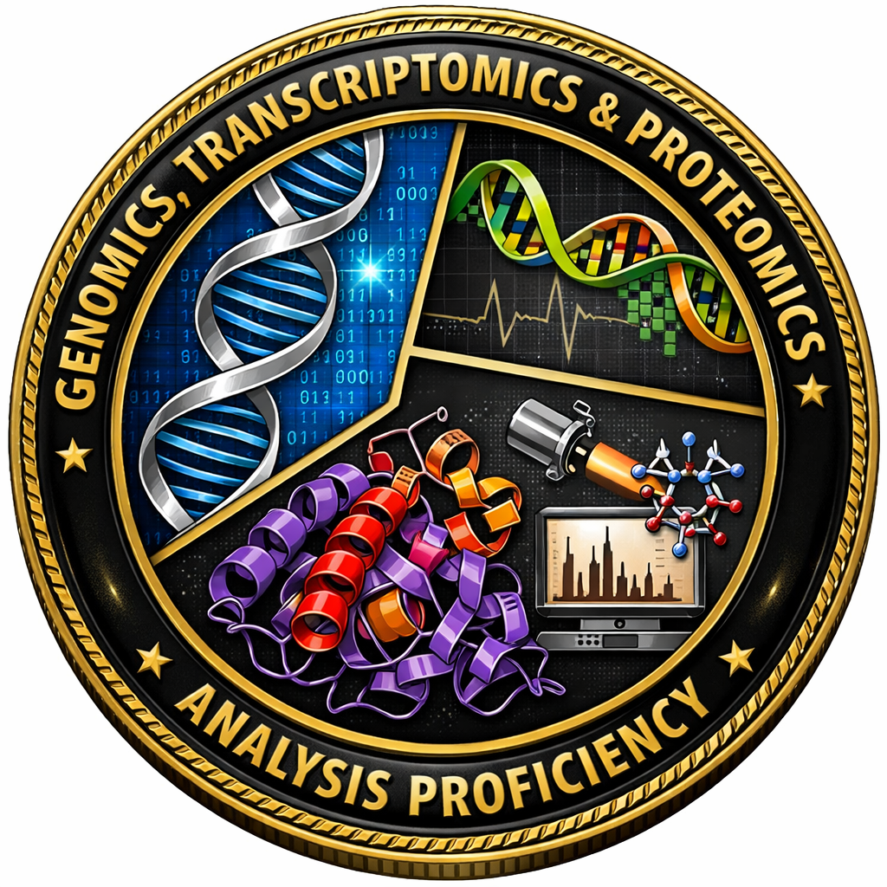

<!-- _class: title -->

# BIOS226 Computational Biology
## Week 1 - Welcome and Module Overview

Dr. Robert Treharne

---

# Welcome to BIOS226
- Computational biology and bioinformatics are about turning biological data into insight
- You will work with real datasets and learn how to justify analytical choices
- We focus on practical skills: data handling, analysis, interpretation, and communication
- The module builds toward an individual case study presentation

<!--
Open by welcoming students and framing the module as skills-focused. Emphasize that
they will learn to make reasoned decisions, not just follow recipes.
-->

---

# Teaching Team
- Natasha Savage (NS) - module organiser
- Robert Treharne (RT) - module lead, supervised learning, case study support
- Stephen Chapman (SC) - data formats, databases, and annotation
- Robert Morris (RM) - QC, statistics, visualisation, genomics, and transcriptomics

<!--
Set expectations about who they will see and when. Use initials as a shorthand for
emails, timetable, and slide references.
-->

---

# How Sessions Will Run
- Weekly lecture: context and background
- Workshops: 2 x 2-hour guided, hands-on; build portfolio evidence
- Use University PCs and participate actively
- Support is during workshops only; work independently outside

<!--
Highlight active learning. Reinforce that the portfolio is built week by week.
-->

---

<!-- _class: content -->
# Content

All resources will be available on the course Canvas.

<!--
Use this slide to show students where the materials live and how to access them.
-->

---

# Timetable at a Glance (Part 1)
Part 1 - Foundations
- Week 1: Introduction and R primer (RT)
- Week 2: Biological data formats, databases, and annotation (SC)
- Week 3: Quality control, normalisation, and essential statistics (RM)
- Week 4: Visualisation and dimensionality reduction (RM)
- Week 5: Supervised learning and model evaluation (RT)
- Week 6 — w/c 02/03/2026 — Assessment week (no BIOS226 assessment this week)

---

# Timetable at a Glance (Part 2)
Part 2 - Applications
- Week 7: Genomics, variant data, and GWAS (RM)
- Week 8: Transcriptomics and differential expression (RM)
- Easter break: no teaching w/c 23/03, 30/03, 06/04
- Week 9: Proteomics, metabolomics, and KEGG pathway analysis (SC)
- Week 10: Case study topic selection and pipeline development (RT)
- Week 11: Case study workshop and preparation
- Week 12: Case study completion and module wrap-up

<!--
Walk through the arc of the module and show how early skills build into the case study.
-->

---

# Attendance Expectations
- Attendance at lectures and workshops is expected
- Workshops are where skills are practiced and supported
- If you miss a session, catch up using the slides and workbook tasks
- Let the teaching team know early if you have ongoing attendance issues
- There are no attendance codes - paper-based register only

<!--
Be clear that attendance supports success, without adding policy not in the handbook.
-->

---

# Assessment Overview
- Two components:
  - Portfolio (60% of the module mark)
  - Case study presentation (40% of the module mark)
- Deadlines: Portfolio final submission Week 10; Case study Week 12

<!--
Keep this high level; later slides unpack each component in detail.
-->

---

# Portfolio (60%) - What is it?
- A curated record of your weekly work
- Workbook templates for each week
- Activities and questions to complete
- Work should be documented and submitted to Canvas weekly
- Text based Viva required for week 5
- In-person Viva week 10

<!--
Explain that the portfolio is about process and reasoning, not just final answers.
-->

---

<!-- _class: table -->
# Portfolio (60%) - Mark Breakdown
The portfolio assesses your practical work across the semester. The viva verifies your understanding of that work.

| Component | What is assessed | Portfolio weighting | Module weighting |
| --- | --- | --- | --- |
| Workbook | Weekly workbooks demonstrating correct methods, accurate analysis, clear figures and outputs, and a reproducible workflow | 70% | 42% |
| Viva | 15-minute in-person viva (Week 10) verifying understanding of submitted workbook work | 30% | 18% |

---

<!-- _class: viva -->
# Viva Practice!
- AutoViva is an online text-based viva tool that helps you practice explaining your work.
- Use it regularly, at least once a week.
- Download your transcripts and include them in your portfolio as evidence.

<!--
Encourage frequent practice and clear evidence capture for the portfolio.
-->

---

# Case Study Presenation (40%) - What is it?
- Individual, conference-style academic presentation
- Delivered to your peers and teaching team
- Based on one substantial biological dataset
- Dataset chosen from a provided range (e.g. genomics, transcriptomics, proteomics)
- Focus is on reasoning and decision-making, not perfect results
- You are assessed on how you think with data, not on producing flawless outputs

<!--
Emphasize authenticity and analytical reasoning over perfect results.
-->

---

# Format, Timing, and Expectations
Format and timing:
- 10 min presentation + 5 min questions
- Delivered during Week 12 workshops
- Preparation supported in Weeks 10 to 11 workshops
- Academic, technical, professional tone expected

<!--
Combine logistics with performance expectations.
-->

---

<!-- _class: table -->
# How is Case Study Assessed?
| Area | What is assessed | Presentation % | Module % |
| --- | --- | --- | --- |
| Data handling | Cleaning, preprocessing, reproducibility | 20 | 8 |
| Analysis | Choice and application of techniques | 25 | 10 |
| Visualisation | Clarity and appropriateness of figures | 15 | 6 |
| Interpretation | Biological meaning and limitations | 25 | 10 |
| Presentation | Structure, clarity, questions | 10 | 4 |
| Timing | Within time limits | 5 | 2 |
| <b>Total</b> |  | <b>100</b> | <b>40</b> |

* Weightings may change. You will be notified of any updates.

---

# Use of Generative AI (GAI)
You may use GAI to:
- Plan structure
- Improve clarity and presentation flow

You remain responsible for:
- Analytical decisions
- Interpretation and accuracy
- Demonstrating understanding

GAI is a support tool, not a substitute for analysis.

<!--
Position GAI as a helper, with ownership and integrity clearly stated.
-->

---

<!-- _class: badge -->

