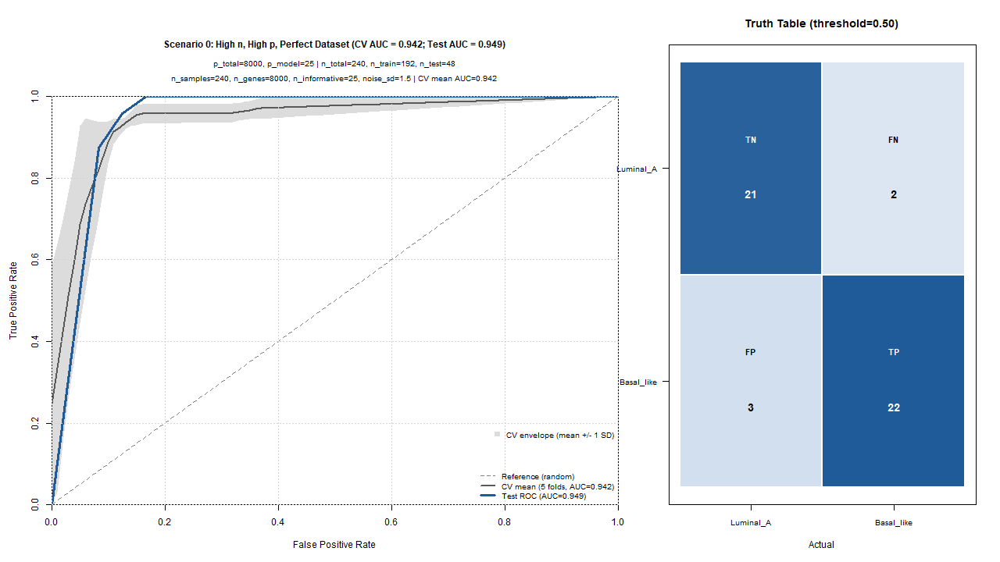
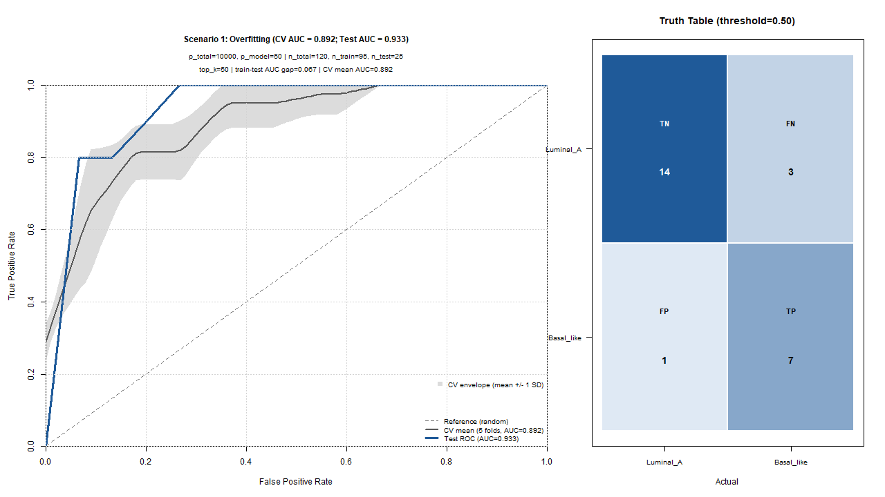
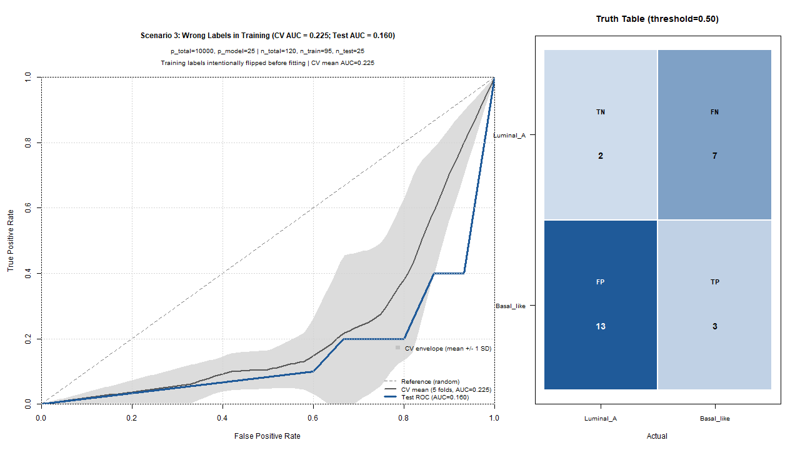
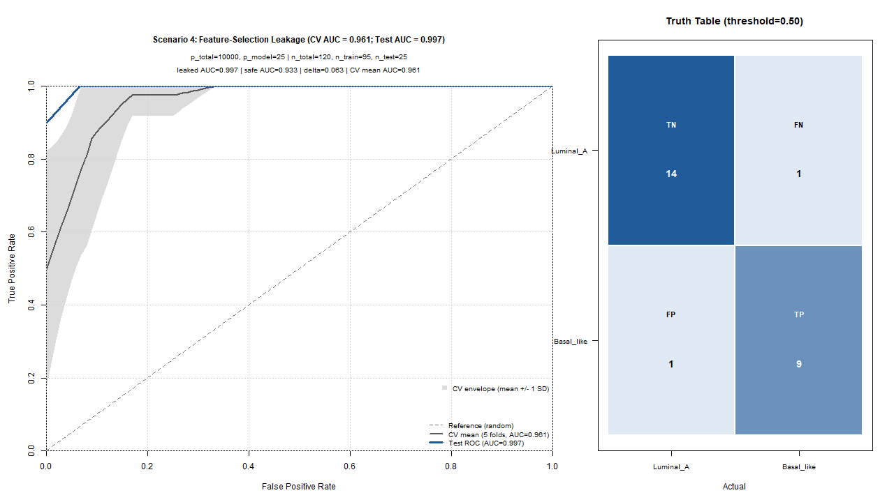
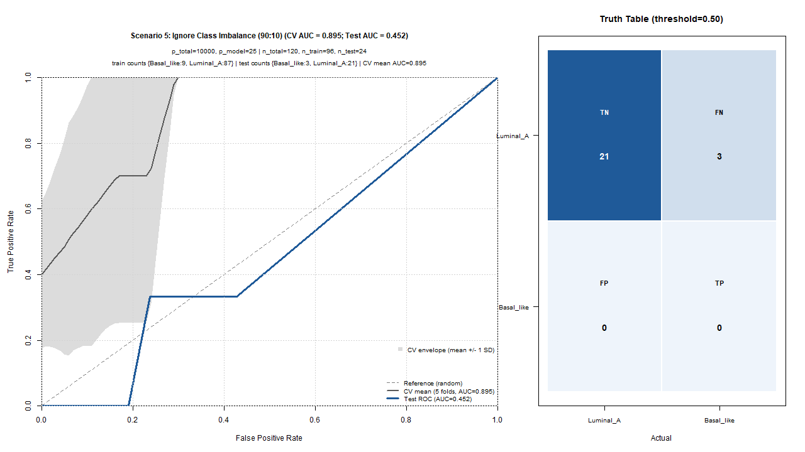

<!-- _class: title -->

# BIOS226 - Topic 5 - Supervised Learning (Part 3)
## How To Fail

Dr. Robert Treharne

---

<!-- _class: overview -->
# Overview

In supervised learning, models rarely fail loudly. They fail silently.

Common failure modes:

- Overfitting (learning noise instead of signal)
- Underfitting (model too simple)
- Data leakage (information from test data enters training)
- Ignoring class imbalance
- Choosing the wrong threshold for the clinical context
- Evaluating on training data only

---

<!-- _class: figure -->

---

<!-- _class: figure -->

---

<!-- _class: figure -->

---

<!-- _class: figure -->

---

<!-- _class: figure -->

---

<!-- _class: figure -->

---

# By the end of this topic, you should be able to:

- Explain the difference between exploratory and supervised learning in biological data
- Describe a leakage-safe supervised learning pipeline from raw data to final evaluation
- Interpret a confusion matrix and ROC curve in a clinical context
- Recognise common failure modes (overfitting, leakage, imbalance, label errors)
- Critically evaluate whether a model is genuinely generalisable or silently flawed
